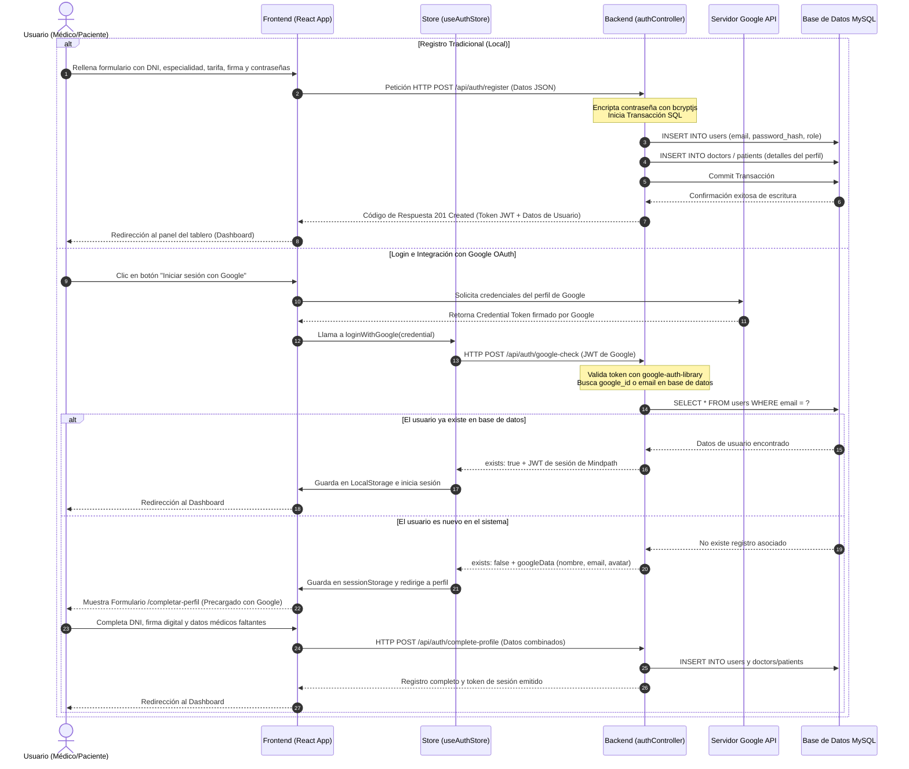
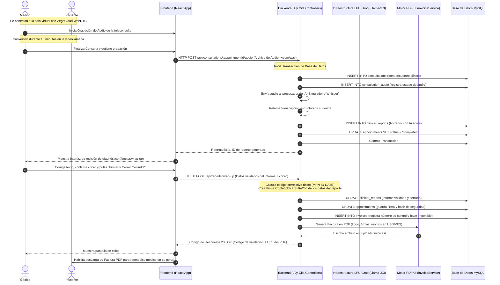
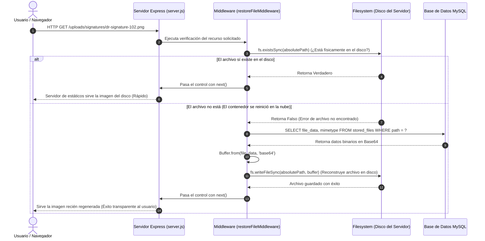

# 🧠 GUÍA DE EXPLICABILIDAD TÉCNICA DEL SISTEMA: MINDPATH NEURO
### *Preparación para la Defensa del Proyecto, Jurado de Evaluación y Exposición Comercial*

Esta guía técnica ha sido elaborada para servir como material de estudio exhaustivo y documento de explicabilidad integral del sistema **Mindpath Neuro**. Está diseñada con el objetivo de permitir que cualquier persona con conocimientos técnicos o comerciales comprenda la arquitectura de software, el flujo de datos extremo a extremo, los componentes neurálgicos de seguridad y el comportamiento dinámico del código en producción.

---

## 🗺️ Módulo 1: Glosario de Términos Técnicos del Sistema

A continuación se presenta un glosario con **43 términos clave** presentes en el stack de Mindpath Neuro (Vite, React, Express, MySQL y Groq AI). Cada concepto incluye su definición formal de ingeniería, una analogía del mundo real y su ubicación o uso específico dentro de este proyecto.

### ⚛️ Frontend & React Stack

#### 1. SPA (Single Page Application - Aplicación de una Sola Página)
*   **Definición Técnica:** Aplicación web que carga un único documento HTML y actualiza dinámicamente el contenido del cuerpo mediante la manipulación del DOM por parte de JavaScript, evitando recargas completas de la página desde el servidor.
*   **Analogía Práctica:** Un menú digital en una tableta de un restaurante donde al pulsar en "Bebidas" el contenido cambia al instante en la misma pantalla, en lugar de que te traigan un menú en papel físico completamente nuevo.
*   **Uso en este Proyecto:** Configurado a través de **Vite** en la carpeta `frontend/`, donde las rutas del cliente se gestionan sin refrescar la página.

#### 2. Virtual DOM (DOM Virtual)
*   **Definición Técnica:** Representación ligera en memoria del DOM del navegador utilizada por React para calcular de forma eficiente qué elementos han cambiado antes de actualizar el DOM real.
*   **Analogía Práctica:** El plano de remodelación de una casa donde el arquitecto borra e ilustra las modificaciones en papel antes de derrumbar y construir paredes reales.
*   **Uso en este Proyecto:** Utilizado internamente por React 19 en todo el `frontend/src/` para repintar eficientemente las listas de pacientes, calendarios y estadísticas.

#### 3. JSX (JavaScript XML)
*   **Definición Técnica:** Extensión de la sintaxis de JavaScript que permite escribir estructuras HTML directamente dentro de archivos de lógica JS en React.
*   **Analogía Práctica:** Un sandwich que mezcla ingredientes salados (HTML/Estructura) con dulces (JS/Lógica) en un solo mordisco.
*   **Uso en este Proyecto:** Es la extensión de archivos de interfaz como [App.jsx](file:///f:/Naye/mindpath-neuro/frontend/src/App.jsx) o [Login.jsx](file:///f:/Naye/mindpath-neuro/frontend/src/pages/Login.jsx).

#### 4. Estado (State)
*   **Definición Técnica:** Objeto JavaScript interno de un componente que almacena datos dinámicos que pueden cambiar durante el ciclo de vida del componente, provocando un re-renderizado al ser modificado.
*   **Analogía Práctica:** La temperatura actual en una pantalla digital de aire acondicionado. Si cambias la temperatura, la pantalla muestra inmediatamente el nuevo número.
*   **Uso en este Proyecto:** Manejado con `useState` para inputs en formularios de registro, estados de modals e interruptores visuales.

#### 5. Hook useState
*   **Definición Técnica:** Función nativa de React que permite añadir y gestionar el estado local dentro de un componente funcional.
*   **Analogía Práctica:** Una libreta de notas de bolsillo que tiene un botón mágico: cada vez que escribes un dato nuevo en ella, la libreta grita en voz alta el cambio para que todos a tu alrededor se enteren.
*   **Uso en este Proyecto:** Declarado en páginas como [Register.jsx](file:///f:/Naye/mindpath-neuro/frontend/src/pages/auth/Register.jsx) para almacenar los pasos del formulario de registro y la información capturada de los doctores.

#### 6. Hook useEffect
*   **Definición Técnica:** Hook de React que permite ejecutar efectos secundarios en componentes funcionales (suscripciones, consultas a APIs, manipulaciones manuales del DOM) en respuesta a cambios en las dependencias.
*   **Analogía Práctica:** Un detector de humo en el techo que se activa solo cuando detecta un cambio en la concentración de partículas de aire (las dependencias del hook).
*   **Uso en este Proyecto:** Usado en [App.jsx](file:///f:/Naye/mindpath-neuro/frontend/src/App.jsx#L41-L50) para cargar las configuraciones de branding e inicializar el tema oscuro (`dark mode`) en cuanto la aplicación se carga en el navegador.

#### 7. Custom Hooks (Hooks Personalizados)
*   **Definición Técnica:** Funciones JavaScript cuyos nombres comienzan con "use" y que pueden llamar a otros hooks de React, permitiendo extraer y reutilizar la lógica de estado entre diferentes componentes.
*   **Analogía Práctica:** Un bloque constructor preensamblado de LEGO que incluye luces y sonido propios, y que puedes conectar en cualquier nave que estés construyendo sin tener que rehacer los cables.
*   **Uso en este Proyecto:** Ubicados en la carpeta `frontend/src/hooks/` para aislar comportamientos reutilizables de UI o peticiones de red.

#### 8. Context (Contexto de React)
*   **Definición Técnica:** Característica de React que provee una forma de pasar datos a través del árbol de componentes sin tener que pasar props manualmente en cada nivel (prop drilling).
*   **Analogía Práctica:** El sistema de altavoces de un centro comercial que transmite la música ambiental a todas las tiendas simultáneamente en vez de ir tienda por tienda con un reproductor portátil.
*   **Uso en este Proyecto:** Usado de manera implícita por los routers y librerías del cliente para distribuir información global.

#### 9. Proveedores (Providers)
*   **Definición Técnica:** Componentes de React que envuelven una sección de la aplicación para hacer que un Contexto o Estado Global esté disponible a todos sus componentes descendientes.
*   **Analogía Práctica:** Un módem de Wi-Fi doméstico que distribuye la señal de internet a cualquier dispositivo que esté dentro de la casa.
*   **Uso en este Proyecto:** Enrutadores como `<BrowserRouter>` (como `<Router>`) en [App.jsx](file:///f:/Naye/mindpath-neuro/frontend/src/App.jsx) que proveen las capacidades de navegación a todos los componentes de la interfaz.

#### 10. Hook useContext
*   **Definición Técnica:** Hook de React que suscribe a un componente a las actualizaciones de un objeto de Contexto, permitiendo leer su valor actual.
*   **Analogía Práctica:** Un sintonizador de radio en tu teléfono que se conecta a la frecuencia del módem inalámbrico para escuchar la música.
*   **Uso en este Proyecto:** Consumido por librerías externas o utilidades dentro de las páginas del panel.

#### 11. Renderizado Condicional
*   **Definición Técnica:** Técnica que permite mostrar diferentes componentes o fragmentos de HTML/JSX según el valor de una expresión lógica o variable de estado.
*   **Analogía Práctica:** Un semáforo inteligente que muestra la luz verde solo si hay autos esperando, y de lo contrario muestra la luz roja.
*   **Uso en este Proyecto:** Implementado en la barra lateral (`Sidebar`) y tableros para mostrar botones de "Doctor" solo si `user.role === 'doctor'`.

#### 12. Enrutamiento del Lado del Cliente (Client-Side Routing)
*   **Definición Técnica:** Mecanismo mediante el cual el frontend intercepta los cambios de URL y renderiza el componente correspondiente sin solicitar una nueva página al servidor web.
*   **Analogía Práctica:** Una centralita telefónica interna en una oficina: marcas la extensión "3" (ventas) y te redirigen internamente sin tener que colgar la llamada y volver a marcar a la calle.
*   **Uso en este Proyecto:** Declarado en [App.jsx](file:///f:/Naye/mindpath-neuro/frontend/src/App.jsx) utilizando la librería `react-router-dom`.

#### 13. Zustand
*   **Definición Técnica:** Librería ligera de gestión de estado global basada en un modelo de almacén centralizado (`store`), que permite actualizar y suscribir componentes a variables globales con mínima sobrecarga de código.
*   **Analogía Práctica:** Un pizarrón gigante en la sala de operaciones de un hospital donde se anota el estado de los quirófanos y todos los médicos lo consultan al pasar.
*   **Uso en este Proyecto:** Definido en los stores globales: [useAuthStore.js](file:///f:/Naye/mindpath-neuro/frontend/src/store/useAuthStore.js) para la autenticación y [useSettingsStore.js](file:///f:/Naye/mindpath-neuro/frontend/src/store/useSettingsStore.js) para el branding y la tasa de cambio.

#### 14. LocalStorage
*   **Definición Técnica:** Objeto de almacenamiento web de tipo clave-valor que guarda datos directamente en el navegador del usuario de forma persistente, incluso después de cerrar la pestaña.
*   **Analogía Práctica:** El cajón del escritorio en tu oficina donde dejas tus lentes y un cuaderno al final del día de trabajo; cuando regresas al día siguiente, siguen ahí.
*   **Uso en este Proyecto:** Almacena el token JWT (`mindpath_token`) y el objeto de datos básicos del usuario (`mindpath_user`) para recordar la sesión activa.

#### 15. Axios
*   **Definición Técnica:** Cliente HTTP basado en promesas que se utiliza en el frontend para realizar peticiones (GET, POST, PUT, DELETE) hacia servidores backend.
*   **Analogía Práctica:** El cartero privado de la empresa al que le entregas una carta con una orden de compra, y él va hasta la sede central de la otra empresa, espera la respuesta y te la trae de vuelta.
*   **Uso en este Proyecto:** Configurado centralmente en [axiosConfig.js](file:///f:/Naye/mindpath-neuro/frontend/src/api/axiosConfig.js).

#### 16. Interceptores de Axios
*   **Definición Técnica:** Funciones que Axios ejecuta automáticamente sobre las peticiones o respuestas antes de que sean procesadas por la aplicación o el servidor.
*   **Analogía Práctica:** El oficial de seguridad de un edificio comercial que le coloca una tarjeta de identificación a cada visitante en el pecho antes de dejarlos entrar al ascensor.
*   **Uso en este Proyecto:** Inyecta automáticamente la cabecera `Authorization: Bearer <token>` en cada petición saliente en [axiosConfig.js](file:///f:/Naye/mindpath-neuro/frontend/src/api/axiosConfig.js#L17-L29).

#### 17. ZegoCloud UIKit
*   **Definición Técnica:** SDK y suite de componentes de interfaz preensamblados para habilitar transmisiones en vivo, llamadas de voz y videollamadas en tiempo real a través de WebRTC.
*   **Analogía Práctica:** Una cabina de videollamadas instantánea que alquilas e instalas en tu centro comercial; solo debes conectarla a la electricidad y ya funciona sin que construyas la tecnología de transmisión.
*   **Uso en este Proyecto:** Habilita las salas de consulta virtual en páginas como [VideoRoom.jsx](file:///f:/Naye/mindpath-neuro/frontend/src/pages/doctor/VideoRoom.jsx).

---

### ⚙️ Backend, Servidor & API Stack

#### 18. Node.js
*   **Definición Técnica:** Entorno de ejecución de JavaScript fuera del navegador, basado en el motor V8 de Google Chrome, utilizado para construir aplicaciones del lado del servidor.
*   **Analogía Práctica:** Sacar el motor de un automóvil de carreras (JavaScript) y montarlo en un generador eléctrico para alimentar una fábrica entera de noche.
*   **Uso en este Proyecto:** La base sobre la cual corre toda la aplicación del backend.

#### 19. Express.js
*   **Definición Técnica:** Framework web minimalista y flexible para Node.js que proporciona herramientas robustas para la creación de servidores API HTTP y middlewares.
*   **Analogía Práctica:** El organizador de eventos en una convención que tiene mesas específicas para recibir registros, prensa o conferencistas, y dirige a la gente según su credencial.
*   **Uso en este Proyecto:** Configurado en [server.js](file:///f:/Naye/mindpath-neuro/backend/server.js) para montar todos los endpoints de la aplicación.

#### 20. API REST (Representational State Transfer)
*   **Definición Técnica:** Estilo de arquitectura de software para sistemas hipermedia distribuidos, basado en la comunicación cliente-servidor sin estado, utilizando los estándares HTTP.
*   **Analogía Práctica:** Un restaurante con un menú estandarizado: pides el plato número 5, te lo preparan igual siempre y se manejan con cubiertos y platos comunes.
*   **Uso en este Proyecto:** Diseñado en los controladores del backend que intercambian datos JSON bajo los verbos de HTTP estándar.

#### 21. Endpoints (Puntos de Acceso / Rutas de API)
*   **Definición Técnica:** URLs específicas expuestas por una API REST a las que el cliente envía peticiones para interactuar con recursos del servidor.
*   **Analogía Práctica:** Las diferentes ventanillas de un banco comercial: una para depósitos, otra para retiros y otra para abrir cuentas.
*   **Uso en este Proyecto:** Rutas como `/api/auth/login`, `/api/doctors/profile` o `/api/appointments/book`.

#### 22. Métodos HTTP (GET, POST, PUT, DELETE)
*   **Definición Técnica:** Verbos estandarizados en el protocolo HTTP que indican la acción que se desea realizar sobre el recurso consultado.
*   **Analogía Práctica:** Los verbos imperativos en español: "Dame" (GET), "Guarda" (POST), "Actualiza" (PUT) y "Elimina" (DELETE).
*   **Uso en este Proyecto:** `GET` para buscar historias clínicas, `POST` para agendar citas o subir comprobantes de pago, y `PUT` para editar perfiles.

#### 23. Status Codes (Códigos de Estado HTTP)
*   **Definición Técnica:** Números de tres dígitos que el servidor devuelve al cliente en la respuesta para indicar el resultado de una petición (2xx éxito, 4xx errores del cliente, 5xx errores del servidor).
*   **Analogía Práctica:** Las señas del árbitro en un partido: pulgar arriba para continuar (200), tarjeta amarilla por falta del jugador (400) o suspensión del juego por mal clima (500).
*   **Uso en este Proyecto:** `200 OK` (Operación exitosa), `201 Created` (Usuario creado), `401 Unauthorized` (Token no enviado), `403 Forbidden` (No es administrador), `404 Not Found` (Cita no existente), `500 Server Error` (Fallo de BD).

#### 24. Middlewares de Express
*   **Definición Técnica:** Funciones en Express que tienen acceso al objeto de petición (`req`), al objeto de respuesta (`res`) y a la siguiente función de middleware en el ciclo de solicitud-respuesta del servidor.
*   **Analogía Práctica:** Un control de aduanas en el aeropuerto donde revisan tu pasaporte e inspeccionan tus maletas antes de dejarte abordar el avión.
*   **Uso en este Proyecto:** [authMiddleware.js](file:///f:/Naye/mindpath-neuro/backend/middlewares/authMiddleware.js) intercepta la petición, valida la firma del token JWT y decide si la petición avanza al controlador final.

#### 25. JSON (JavaScript Object Notation)
*   **Definición Técnica:** Formato ligero de intercambio de datos, legible para humanos y fácil de analizar y generar por computadoras.
*   **Analogía Práctica:** El formulario de aduanas estándar que rellenan todos los viajeros del mundo con los mismos campos fijos organizados por llaves y valores.
*   **Uso en este Proyecto:** Formato universal con el que se comunican las APIs del backend y el frontend de Mindpath Neuro.

#### 26. JWT (JSON Web Token)
*   **Definición Técnica:** Estándar abierto (RFC 7519) que define un medio compacto y autónomo para transmitir información de forma segura entre las partes como un objeto JSON, firmado digitalmente con una clave secreta.
*   **Analogía Práctica:** Un brazalete impermeable codificado que te colocan en la entrada de un parque de atracciones todo incluido y que las atracciones leen para dejarte entrar sin pedir tu identificación original en cada juego.
*   **Uso en este Proyecto:** Generado al iniciar sesión en el backend y retornado al cliente para asegurar sus accesos durante 8 horas.

#### 27. Hashing y Bcrypt
*   **Definición Técnica:** Proceso algorítmico unidireccional que toma un texto plano (contraseña) y lo convierte en una cadena alfanumérica de longitud fija imposible de revertir. Bcrypt añade un factor de "sal" (salt) aleatorio para evitar ataques de tablas de arcoíris.
*   **Analogía Práctica:** Una máquina trituradora industrial: metes una manzana y sale puré homogéneo; es imposible reconstruir la manzana a partir del puré, pero dos manzanas idénticas dan el mismo peso de puré.
*   **Uso en este Proyecto:** Implementado en [authController.js](file:///f:/Naye/mindpath-neuro/backend/controllers/authController.js#L52-L53) para encriptar las contraseñas de los usuarios antes de escribirlas en la base de datos MySQL.

#### 28. Variables de Entorno (.env)
*   **Definición Técnica:** Variables externas a la aplicación que se configuran en el sistema operativo o contenedor para alimentar configuraciones sensibles del código (claves de API, contraseñas de BD) sin exponerlas en el código fuente de Git.
*   **Analogía Práctica:** El código de la caja fuerte de tu oficina: no lo dejas escrito en el pizarrón público, sino que lo configuras en la memoria del teclado numérico de la pared.
*   **Uso en este Proyecto:** Ubicadas en los archivos `.env` tanto de frontend como de backend para almacenar el host de base de datos, credenciales SMTP y claves de ZegoCloud y Groq AI.

#### 29. Multer
*   **Definición Técnica:** Middleware para Express diseñado para manejar datos multiparte (`multipart/form-data`), utilizado principalmente para subir archivos al servidor.
*   **Analogía Práctica:** La cinta transportadora de equipaje de un aeropuerto que toma maletas pesadas e individuales del mostrador y las etiqueta para ponerlas en el almacén del avión.
*   **Uso en este Proyecto:** Gestiona la subida de comprobantes de pago de los pacientes, fotos de firmas digitales y títulos de los médicos.

#### 30. Nodemailer
*   **Definición Técnica:** Módulo para aplicaciones Node.js que permite el envío de correos electrónicos de forma sencilla a través de servidores SMTP.
*   **Analogía Práctica:** Una oficina de correos automatizada dentro de tu empresa que mete facturas en sobres, les pega timbres postales y los echa en el buzón central del destinatario de forma autónoma.
*   **Uso en este Proyecto:** Envía correos de restablecimiento de contraseña e notifica a los doctores cuando sus perfiles han sido verificados o rechazados por el Administrador.

#### 31. PDFKit
*   **Definición Técnica:** Librería de generación de PDFs para Node.js que permite construir documentos con texto estructurado, imágenes y gráficos vectoriales desde código backend.
*   **Analogía Práctica:** Una imprenta física automatizada a la que le pasas un molde de texto e imágenes y te saca un folleto listo para entregar al cliente.
*   **Uso en este Proyecto:** Genera en caliente las facturas en formato PDF para los reembolsos médicos en [reportController.js](file:///f:/Naye/mindpath-neuro/backend/controllers/reportController.js#L246).

#### 32. Groq SDK
*   **Definición Técnica:** Kit de desarrollo de software para interactuar con la infraestructura LPU de Groq, consumiendo modelos de lenguaje masivos (LLMs) de manera extremadamente rápida.
*   **Analogía Práctica:** Un teléfono satelital ultrarrápido conectado a una supercomputadora con un médico genio de guardia permanente, al que le lees notas de voz y te devuelve la receta estructurada en segundos.
*   **Uso en este Proyecto:** Integrado en [iaController.js](file:///f:/Naye/mindpath-neuro/backend/controllers/iaController.js) para analizar la consulta clínica y estructurar automáticamente los reportes médicos bajo el modelo `llama-3.3-70b-versatile`.

---

### 🗄️ Base de Datos & SQL Stack

#### 33. Motor de Base de Datos (MySQL)
*   **Definición Técnica:** Sistema relacional de gestión de bases de datos que organiza la información en tablas estructuradas interconectadas por relaciones lógicas.
*   **Analogía Práctica:** Un archivador gigante de metal con cajones numerados y carpetas ordenadas donde las hojas de un cajón hacen referencia a códigos de carpetas de otro cajón.
*   **Uso en este Proyecto:** Gestiona todo el almacenamiento relacional del sistema Mindpath Neuro.

#### 34. Tablas y Filas (Tables & Rows)
*   **Definición Técnica:** Componentes básicos de una base de datos relacional. La tabla representa el modelo o entidad y las filas representan cada registro individual de esa entidad.
*   **Analogía Práctica:** Una planilla de cálculo de Excel donde las columnas son los campos fijos (Nombre, Teléfono) y las filas son los datos de cada paciente que se registra.
*   **Uso en este Proyecto:** Tablas como `users` donde cada fila es un usuario del sistema.

#### 35. Primary Key (PK) y Foreign Key (FK)
*   **Definición Técnica:** La PK es una columna cuyo valor identifica de forma única a cada fila de una tabla. La FK es una restricción que vincula una columna de una tabla con la PK de otra tabla.
*   **Analogía Práctica:** La PK es tu número de DNI que te identifica únicamente en tu país. La FK es el DNI de tu padre anotado en tu partida de nacimiento para asociarte con su registro familiar.
*   **Uso en este Proyecto:** La tabla `patients` tiene un campo `user_id` que es una Foreign Key apuntando a `users.id` (su Primary Key).

#### 36. Pool de Conexiones (Connection Pools)
*   **Definición Técnica:** Caché de conexiones activas a la base de datos que se mantienen abiertas para que puedan ser reutilizadas por múltiples clientes concurrentes, evitando la sobrecarga de abrir y cerrar conexiones en cada petición.
*   **Analogía Práctica:** Una flota de 10 taxis estacionados fuera de un hotel. En lugar de mandar a construir un taxi nuevo cada vez que un huésped quiere salir, el hotel le asigna uno de la flota disponible; al volver, el taxi se estaciona de nuevo y espera.
*   **Uso en este Proyecto:** Configurado en [db.js](file:///f:/Naye/mindpath-neuro/backend/config/db.js#L6-L17) con un límite máximo de 10 conexiones concurrentes (`connectionLimit: 10`).

#### 37. Sentencias Preparadas (Prepared Statements)
*   **Definición Técnica:** Técnica de ejecución de consultas SQL donde el motor compila la plantilla de la consulta antes de insertar los parámetros reales enviados por el usuario, evitando ataques de inyección SQL.
*   **Analogía Práctica:** Un formulario de papel oficial preimpreso donde solo puedes escribir dentro de casillas en blanco con tu lápiz; por más que intentes escribir una orden de liberación fuera de las casillas, la policía del banco ignorará lo que no esté en la casilla autorizada.
*   **Uso en este Proyecto:** Implementadas en las consultas de Node con `mysql2` utilizando el placeholder `?` en lugar de concatenar texto.

#### 38. Transacciones SQL (SQL Transactions)
*   **Definición Técnica:** Grupo de operaciones SQL que se ejecutan como una única unidad lógica de trabajo. Siguen el principio ACID (Atomicidad, Consistencia, Aislamiento y Durabilidad).
*   **Analogía Práctica:** Hacer una transferencia bancaria electrónica: a ti te debitan $100 y a tu amigo le acreditan $100. Si el sistema se apaga justo a la mitad, el banco no te quita el dinero a ti si no puede dárselo a él; la transacción se cancela por completo para mantener la coherencia.
*   **Uso en este Proyecto:** Usadas en procesos neurálgicos como el registro de usuario + rol y el procesamiento de audio/consultas.

#### 39. Commit y Rollback
*   **Definición Técnica:** `Commit` confirma y consolida permanentemente todas las operaciones de la transacción en la base de datos. `Rollback` cancela y revierte todas las escrituras al estado previo a la transacción si ocurre un fallo.
*   **Analogía Práctica:** Trabajar en un documento de Word: `Commit` es pulsar "Guardar" para escribir en el disco; `Rollback` es presionar "Ctrl+Z" (Deshacer) para borrar todos los cambios recientes porque cometiste un error.
*   **Uso en este Proyecto:** Declarados en [consultationController.js](file:///f:/Naye/mindpath-neuro/backend/controllers/consultationController.js#L51-L59) para asegurar que no queden reportes clínicos huérfanos sin cita completada.

#### 40. Soft Delete vs Hard Delete
*   **Definición Técnica:** `Hard Delete` borra permanentemente la fila de la base de datos física mediante una sentencia `DELETE`. `Soft Delete` simplemente cambia el estado lógico del registro (por ejemplo, `is_active = FALSE` o `deleted_at = TIMESTAMP`), ocultándolo en las consultas normales sin eliminarlo del disco.
*   **Analogía Práctica:** `Hard Delete` es quemar una carta confidencial en la chimenea; `Soft Delete` es archivarla en la caja de documentos pasados en el sótano.
*   **Uso en este Proyecto:** En la tabla `users` mediante el campo `is_active`, permitiendo desactivar usuarios sin perder su historial clínico histórico.

#### 41. Firma Digital Hash SHA-256
*   **Definición Técnica:** Algoritmo criptográfico que genera un identificador alfanumérico único para un volumen de datos. Cualquier alteración de un solo bit en los datos originales cambiará el hash resultante por completo.
*   **Analogía Práctica:** El sello de cera medieval en un sobre lacrado: si alguien abre el sobre para leer o modificar la carta, la cera se rompe y el destinatario sabrá de inmediato que fue manipulada.
*   **Uso en este Proyecto:** Generado al cerrar la consulta en [reportController.js](file:///f:/Naye/mindpath-neuro/backend/controllers/reportController.js#L110-L120) para blindar la autenticidad del reporte médico emitido para reembolsos.

#### 42. Auto-saneamiento de Encoding (Double-Encoding Cleanup)
*   **Definición Técnica:** Parche de base de datos ejecutado al inicio para limpiar y estandarizar caracteres corruptos originados por diferencias de configuración de charset entre servidores de desarrollo y producción.
*   **Analogía Práctica:** Un corrector ortográfico automático que revisa los carteles de las tiendas apenas abre el mercado para corregir errores de tipografía o acentos mal dibujados.
*   **Uso en este Proyecto:** Declarado en la función `cleanCorruptAccents` dentro de [db.js](file:///f:/Naye/mindpath-neuro/backend/config/db.js#L20-L73).

#### 43. Almacenamiento Efímero y Autorestauración en Caliente (Self-Healing Storage)
*   **Definición Técnica:** Técnica de resiliencia en la nube donde los archivos estáticos se guardan de forma redundante como cadenas Base64 en la base de datos relacional y se reconstruyen dinámicamente en el disco físico del servidor web si este se reinicia y pierde su almacenamiento temporal.
*   **Analogía Práctica:** Un restaurante con una impresora 3D que puede volver a fabricar sus propios vasos y platos a partir de planos digitales archivados bajo tierra en caso de que ocurra una tormenta y destruya los platos del salón.
*   **Uso en este Proyecto:** Implementado en [persistentStorage.js](file:///f:/Naye/mindpath-neuro/backend/utils/persistentStorage.js) para asegurar la persistencia de las firmas digitales y firmas en plataformas en la nube efímeras como Railway o Heroku.

---

## 📂 Módulo 2: Mapa de Archivos Estrella del Sistema

A continuación se analizan los **20 archivos más importantes** del proyecto, detallando su responsabilidad y rol arquitectónico dentro de Mindpath Neuro.

```
mindpath-neuro/
├── backend/
│   ├── server.js (1)
│   ├── config/
│   │   └── db.js (2)
│   ├── controllers/
│   │   ├── authController.js (6)
│   │   ├── adminController.js (7)
│   │   ├── reportController.js (8)
│   │   └── consultationController.js (9)
│   ├── middlewares/
│   │   └── authMiddleware.js (5)
│   ├── services/
│   │   └── aiService.js (10)
│   ├── utils/
│   │   └── persistentStorage.js (11)
│   ├── verify_and_sync_db.js (3)
│   └── setupDB.js (4)
└── frontend/
    └── src/
        ├── main.jsx (12)
        ├── App.jsx (13)
        ├── api/
        │   └── axiosConfig.js (14)
        ├── store/
        │   ├── useSettingsStore.js (15)
        │   └── useAuthStore.js (16)
        └── pages/
            ├── auth/
            │   └── Register.jsx (17)
            └── doctor/
                ├── PatientFile.jsx (18)
                ├── WrapUp.jsx (19)
                └── VideoRoom.jsx (20)
```

| # | Archivo | Ruta Relativa | Responsabilidad Clave |
|---|---|---|---|
| **1** | `server.js` | `backend/server.js` | **Punto de Entrada del Backend**. Inicializa el servidor Express, define middlewares globales (CORS, parser), sirve la carpeta `/uploads` y maneja la auto-generación dinámica de facturas médicas PDF que se pierden en discos efímeros. |
| **2** | `db.js` | `backend/config/db.js` | **Configuración de MySQL y Pool de Conexiones**. Implementa el sistema de autocuración de acentos corruptos y realiza parches automáticos de la estructura al arrancar (como agregar la columna `hide_sidebar_text`). |
| **3** | `verify_and_sync_db.js` | `backend/verify_and_sync_db.js` | **Motor de Migración y Esquema Auto-Sanador**. Compara el estado actual de MySQL contra el esquema esperado de producción e inyecta tablas (`invoices`, `doctor_clinics`, etc.) o columnas faltantes automáticamente. |
| **4** | `setupDB.js` | `backend/setupDB.js` | **Instalador de Base de Datos**. Permite desplegar la base de datos desde cero ejecutando el archivo SQL maestro e insertando automáticamente el usuario administrador por defecto (`admin@admin.com`). |
| **5** | `authMiddleware.js` | `backend/middlewares/authMiddleware.js` | **Seguridad a Nivel de Ruta**. Extrae el token JWT del encabezado `Authorization`, verifica su autenticidad y añade los datos decodificados del usuario a la petición (`req.user`). |
| **6** | `authController.js` | `backend/controllers/authController.js` | **Controlador de Autenticación**. Administra el registro tradicional, la creación de registros asociados en pacientes/médicos dentro de transacciones, login tradicional, verificación e integración de Google OAuth2 y recuperación de contraseñas. |
| **7** | `adminController.js` | `backend/controllers/adminController.js` | **Controlador de Administración**. Ejecuta el agrupamiento de métricas complejas para el tablero administrativo, la gestión de configuraciones visuales del sistema y la sincronización automática de la tasa BCV mediante APIs externas. |
| **8** | `reportController.js` | `backend/controllers/reportController.js` | **Controlador de Informes y Cierre Clínico**. Calcula el Hash de verificación legal SHA-256 para firmar el expediente del paciente, genera el PDF de reembolso médico con PDFKit y completa las citas de forma permanente. |
| **9** | `consultationController.js`| `backend/controllers/consultationController.js`| **Controlador de Consulta Virtual e Inteligencia Artificial**. Ejecuta una transacción multi-tabla para crear la consulta, asociar el audio cargado, solicitar el resumen médico a la IA de simulación y culminar el estado de la cita. |
| **10**| `aiService.js` | `backend/services/aiService.js` | **Simulador de Procesamiento de IA**. Emula el análisis cognitivo y procesamiento de transcripciones médicas (Whisper + Llama) retornando diagnósticos estructurados. |
| **11**| `persistentStorage.js` | `backend/utils/persistentStorage.js` | **Capa de Resiliencia en la Nube**. Middleware y utilidades que convierten archivos subidos en Base64 para guardarlos en la base de datos y reconstruirlos en el disco físico en caliente si el servidor se reinicia. |
| **12**| `main.jsx` | `frontend/src/main.jsx` | **Punto de Entrada del Frontend**. Monta la aplicación React 19 en el contenedor del DOM real (`index.html`) e inicializa los estilos generales de Tailwind CSS. |
| **13**| `App.jsx` | `frontend/src/App.jsx` | **Orquestador Visual y Enrutador**. Gestiona la navegación de la Single Page Application (SPA), inyecta los estilos dinámicos desde la BD al iniciar y aplica protección de rutas según el rol del usuario. |
| **14**| `axiosConfig.js` | `frontend/src/api/axiosConfig.js` | **Red de Seguridad y Transporte HTTP**. Configura la instancia de Axios con la URL base del backend, y provee un interceptor que añade automáticamente el token JWT a todas las solicitudes. |
| **15**| `useSettingsStore.js` | `frontend/src/store/useSettingsStore.js` | **Almacén Zustand de Branding Dinámico**. Modifica el título de la página, carga tipografías directamente desde Google Fonts, actualiza favicons e inyecta variables CSS personalizadas (`--color-primary`) en el DOM. |
| **16**| `useAuthStore.js` | `frontend/src/store/useAuthStore.js` | **Almacén Zustand de Estado de Sesión**. Administra los estados de carga, inicio y cierre de sesión de usuarios y gestiona las redirecciones para flujos incompletos de Google Sign-in. |
| **17**| `Register.jsx` | `frontend/src/pages/auth/Register.jsx` | **Interfaz de Registro Multipasos**. Formulario dinámico que captura datos diferenciados entre Médicos (licencias, tarifas, firmas) y Pacientes (seguros, condiciones médicas). |
| **18**| `PatientFile.jsx` | `frontend/src/pages/doctor/PatientFile.jsx` | **Expediente Clínico Digital**. Interfaz donde el doctor visualiza el historial de consultas del paciente, descarga reportes anteriores y gestiona archivos adjuntos. |
| **19**| `WrapUp.jsx` | `frontend/src/pages/doctor/WrapUp.jsx` | **Panel de Cierre Clínico y Facturación**. Formulario donde el médico refina el diagnóstico sugerido por la IA y confirma el pago para generar el comprobante legal de reembolso. |
| **20**| `VideoRoom.jsx` | `frontend/src/pages/doctor/VideoRoom.jsx` | **Sala de Telemedicina**. Inicializa el iframe interactivo de ZegoCloud UIKit para habilitar la transmisión cifrada de video y audio durante la teleconsulta neurológica. |

---

## 🔑 Módulo 3: Explicación de Bloques de Código Neurálgicos

A continuación se desglosan **5 bloques de código complejos e indispensables** para la lógica del sistema Mindpath Neuro.

### 1. Transacciones SQL en el Procesamiento de Consulta (`consultationController.js`)
Este bloque es el responsable de asociar el audio de consulta a la base de datos y generar el borrador clínico utilizando transacciones de MySQL para proteger la integridad relacional de la base de datos.

```javascript
// backend/controllers/consultationController.js (Líneas 12-64)
const connection = await db.getConnection();
await connection.beginTransaction();

try {
    // 1. Crear el registro del encuentro (Consultation)
    const [consultationRes] = await connection.query(
        'INSERT INTO consultations (appointment_id, start_datetime, end_datetime) VALUES (?, NOW() - INTERVAL 15 MINUTE, NOW()) ON DUPLICATE KEY UPDATE id=LAST_INSERT_ID(id)',
        [appointmentId]
    );
    const consultationId = consultationRes.insertId;

    // 2. Guardar el registro del Audio
    await connection.query(
        'INSERT INTO consultation_audio (consultation_id, file_path, status) VALUES (?, ?, ?) ON DUPLICATE KEY UPDATE file_path=VALUES(file_path), status=VALUES(status)',
        [consultationId, audioFile.path, 'completed']
    );

    // 3. Mandar a la IA a trabajar (Servicio Asíncrono)
    const aiData = await aiService.processConsultationAudio(audioFile.path);

    // 4. Guardar el Borrador del Informe Clínico
    const [reportRes] = await connection.query(
        `INSERT INTO clinical_reports 
        (consultation_id, background, neurological_findings, treatment_plan, ai_confidence_score, is_validated) 
        VALUES (?, ?, ?, ?, ?, false)
        ON DUPLICATE KEY UPDATE 
        background=VALUES(background), 
        neurological_findings=VALUES(neurological_findings), 
        treatment_plan=VALUES(treatment_plan), 
        ai_confidence_score=VALUES(ai_confidence_score), 
        is_validated=false,
        id=LAST_INSERT_ID(id)`,
        [consultationId, aiData.background, aiData.neurological_findings, aiData.treatment_plan, aiData.ai_confidence_score]
    );

    // 5. Actualizar el estado de la cita a 'completed'
    await connection.query('UPDATE appointments SET status = "completed" WHERE id = ?', [appointmentId]);

    await connection.commit(); // Confirmamos los cambios en la BD

} catch (error) {
    await connection.rollback(); // Si algo falla, deshacemos todo
    console.error("Error en el motor de IA:", error);
    res.status(500).json({ message: 'Error al procesar la consulta con la IA.' });
} finally {
    connection.release();
}
```

#### 🔍 Explicación Técnica Paso a Paso:
1.  **`db.getConnection()` y `beginTransaction()`**: Solicita una conexión física del Pool de conexiones y desactiva el modo `autocommit` en MySQL. A partir de esta línea, ninguna escritura en disco se hace pública para otros usuarios del sistema hasta que se indique explícitamente.
2.  **Paso 1: `INSERT INTO consultations`**: Registra la sesión de la teleconsulta. Si por alguna razón la cita ya tiene una sesión iniciada, se evita un choque utilizando `ON DUPLICATE KEY UPDATE` indicando que devuelva el ID del registro ya existente con `LAST_INSERT_ID(id)`.
3.  **Paso 2: `INSERT INTO consultation_audio`**: Registra la ruta en disco del archivo de audio de la consulta vinculándola al ID de la sesión médica recién obtenida.
4.  **Paso 3: `aiService.processConsultationAudio`**: Llama al módulo simulador de inteligencia artificial que retorna un bloque estructurado con antecedentes, hallazgos y tratamiento.
5.  **Paso 4: `INSERT INTO clinical_reports`**: Escribe el borrador del reporte clínico con las sugerencias de la IA utilizando de nuevo una cláusula de seguridad para evitar duplicados en la base de datos.
6.  **Paso 5: `UPDATE appointments`**: Cambia el estado de la cita a `'completed'` para que el paciente la vea completada en su portal.
7.  **`connection.commit()`**: Consolida atómicamente todos los cambios. Si los cinco pasos previos fueron exitosos, se escriben en disco de manera definitiva.
8.  **`connection.rollback()`**: Se ejecuta dentro del bloque `catch`. Si cualquiera de las sentencias SQL falla o el procesador de IA se cae, deshace cualquier insert o update ejecutado en esta conexión devolviendo la base de datos a su estado original.
9.  **`connection.release()`**: Libera la conexión y la devuelve al Connection Pool para que pueda ser utilizada por otras peticiones del servidor.

---

### 2. Firma Digital y Hash de Seguridad Criptográfica (`reportController.js`)
Este bloque es el que garantiza que el reporte médico no ha sido modificado posterior a su firma por el médico, proporcionando una cadena criptográfica de auditoría inalterable.

```javascript
// backend/controllers/reportController.js (Líneas 109-120)
const legalVerificationCode = `MPN-${appointmentId}-${Date.now().toString(36).toUpperCase()}`;
const legalVerificationHash = crypto
    .createHash('sha256')
    .update(JSON.stringify({
        appointmentId,
        doctorId,
        paymentReceived: !!paymentReceived,
        paymentReference: paymentReference || null,
        isShared: !!isShared,
        report: { motivo_sintomas, antecedentes, hallazgos, diagnostico, tratamiento, estudios_observaciones },
    }))
    .digest('hex');
```

#### 🔍 Explicación Técnica Paso a Paso:
1.  **`legalVerificationCode`**: Crea un código único alfanumérico legible para humanos compuesto por el prefijo "MPN" (MindPath Neuro), el ID de la cita correspondiente y el timestamp actual codificado en base 36.
2.  **`crypto.createHash('sha256')`**: Llama a la librería nativa de criptografía de Node.js para inicializar el motor de encriptación unidireccional SHA-256.
3.  **`.update(JSON.stringify({...}))`**: Convierte a formato de cadena JSON plano y exacto el conjunto de datos críticos del informe médico (ID del médico, ID de la cita, estado y referencia de pago, y los 6 bloques clínicos del reporte). Esta cadena de texto alimenta el algoritmo del hash.
4.  **`.digest('hex')`**: Procesa la entrada y emite una firma hexadecimal única de 64 caracteres. Esta firma es inalterable: si alguien cambia aunque sea un punto o una coma del diagnóstico o del monto cobrado en la base de datos, al volver a calcular el Hash no coincidirá con la firma digital registrada originalmente en la cita.

---

### 3. Recuperación en Caliente para Almacenamiento Efímero (`persistentStorage.js`)
Para evitar la pérdida de firmas y certificados en servidores con discos volátiles/efímeros (como contenedores Railway que se destruyen y reconstruyen en cada despliegue), este middleware intercepta los archivos solicitados y los restaura a partir de la base de datos.

```javascript
// backend/utils/persistentStorage.js (Líneas 32-65)
const restoreFileMiddleware = async (req, res, next) => {
    try {
        const relativeUrl = '/uploads' + req.path;
        const publicDir = path.join(__dirname, '..', 'public');
        const absolutePath = path.join(publicDir, 'uploads', req.path);

        // Si ya existe físicamente en el disco, express.static lo servirá de inmediato
        if (fs.existsSync(absolutePath)) {
            return next();
        }

        // Si no existe físicamente, lo recuperamos de la base de datos
        const [rows] = await db.query('SELECT file_data, mimetype FROM stored_files WHERE file_path = ?', [relativeUrl]);
        if (rows && rows.length > 0) {
            console.log(`🔄 [Self-Healing] Restaurando archivo desde BD al disco: ${relativeUrl}`);
            const base64Data = rows[0].file_data;
            const buffer = Buffer.from(base64Data, 'base64');
            
            // Asegurar que exista la carpeta contenedora
            const dir = path.dirname(absolutePath);
            if (!fs.existsSync(dir)) {
                fs.mkdirSync(dir, { recursive: true });
            }

            fs.writeFileSync(absolutePath, buffer);
            console.log(`✅ Archivo regenerado exitosamente en disco: ${absolutePath}`);
        }
        next();
    } catch (err) {
        console.error(`❌ Error en restoreFileMiddleware para ${req.path}:`, err.message);
        next();
    }
};
```

#### 🔍 Explicación Técnica Paso a Paso:
1.  **`fs.existsSync(absolutePath)`**: Express recibe la petición para un archivo dentro del directorio `/uploads`. El sistema primero verifica si el archivo físico está presente en el disco duro local del servidor. Si existe, llama a `next()` permitiendo que el servidor de estáticos convencional lo devuelva al instante.
2.  **`db.query(...)`**: Si el archivo físico no está (lo que ocurre tras reinicios del contenedor en la nube), el middleware busca la URL del archivo en la tabla de base de datos persistente `stored_files`.
3.  **`Buffer.from(base64Data, 'base64')`**: Si encuentra el registro, extrae el string codificado en base64 de la columna `file_data` y lo reconstruye en un búfer binario crudo.
4.  **`fs.mkdirSync(...)` y `fs.writeFileSync(...)`**: Crea de manera recursiva las carpetas necesarias en el disco del servidor (como `public/uploads/signatures`) y escribe el archivo binario recreándolo con el mismo nombre y extensión originales.
5.  **`next()`**: Al finalizar la restauración en caliente en milisegundos, llama a `next()` para que la ruta de estáticos sirva el archivo restaurado sin provocar un error 404 en el navegador del usuario.

---

### 4. Sincronización Resiliente de Tasa de Cambio BCV con APIs de Respaldo (`adminController.js`)
Dado que la economía del sistema requiere calcular precios dinámicamente en Bolívares (VES) a partir de precios base en USD (y los pacientes pagan mediante Pago Móvil), el sistema sincroniza automáticamente el tipo de cambio oficial utilizando múltiples APIs.

```javascript
// backend/controllers/adminController.js (Líneas 318-363)
const performBcvSyncInternal = async () => {
    try {
        let newRate = null;

        // INTENTO 1: API pública dolarapi.com (Oficial)
        try {
            const response1 = await axios.get('https://ve.dolarapi.com/v1/dolares/oficial', { timeout: 3500 });
            if (response1.status === 200 && response1.data) {
                newRate = parseFloat(response1.data.promedio || response1.data.venta || response1.data.compra); 
            }
        } catch (err) {
            console.warn("Intento 1 falló (dolarapi.com oficial). Probando respaldo...");
        }

        // INTENTO 2: API de respaldo (pydolarve.org - Nueva API de la comunidad)
        if (!newRate) {
            try {
                const response2 = await axios.get('https://pydolarve.org/api/v1/dollar?page=bcv', { timeout: 3500 });
                if (response2.status === 200 && response2.data) {
                    const data2 = response2.data;
                    newRate = parseFloat(data2.monitors?.bcv?.price || data2.monitors?.usd?.price || data2.price);
                }
            } catch (err) {
                console.warn("Intento 2 falló (pydolarve.org).");
            }
        }

        // Si ambas APIs fallan o devuelven valores nulos
        if (!newRate || isNaN(newRate)) {
            throw new Error('Las APIs de consulta están caídas en este momento.');
        }

        // Guardamos la tasa correcta en la Base de Datos
        await db.query(
            'UPDATE system_settings SET exchange_rate = ?, exchange_rate_updated_at = CURRENT_TIMESTAMP WHERE id = 1',
            [newRate]
        );
        
        console.log(`[CRON] Tasa BCV sincronizada automáticamente: Bs. ${newRate}`);
        return { success: true, rate: newRate };

    } catch (error) {
        console.error("[CRON] Error sincronizando BCV:", error.message || error);
        return { success: false, error: 'Falló la conexión automática con el Banco Central.' };
    }
};
```

#### 🔍 Explicación Técnica Paso a Paso:
1.  **Intento 1 (`ve.dolarapi.com`)**: Llama a la primera API de tasas utilizando Axios con un tiempo de espera restrictivo de `3500ms`. Si la API responde a tiempo, analiza los decimales para extraer el promedio oficial de cotización del Banco Central de Venezuela.
2.  **Bloque Try-Catch Interno**: Si la primera API da un error de red (como un bloqueo del servidor o caída de la plataforma), el flujo es capturado por un catch interno que muestra una advertencia en la consola pero no detiene la ejecución general del programa.
3.  **Intento 2 (`pydolarve.org`)**: Si `newRate` sigue vacío, ejecuta una segunda petición HTTP de respaldo a un proveedor alternativo bajo las mismas condiciones de tiempo de espera controlado.
4.  **Validación de Fallo Completo**: Si ambas APIs responden con error o el dato no es convertible a un número, lanza un error general para evitar sobrescribir el tipo de cambio real con un valor erróneo de `0` o `NaN`.
5.  **`UPDATE system_settings`**: Si la tasa es correcta, la actualiza en la tabla de configuración administrativa de la base de datos actualizando la columna `exchange_rate_updated_at` para registrar el momento exacto del ajuste económico.

---

### 5. Inyección Dinámica de Estilos y Google Fonts (`useSettingsStore.js`)
Este almacén Zustand en el frontend es el encargado de materializar las personalizaciones visuales (colores primarios del tema, fuentes y logos de clínica) guardadas por el administrador directamente sobre el DOM del navegador.

```javascript
// frontend/src/store/useSettingsStore.js (Líneas 11-28 y 66-99)
const loadGoogleFont = (fontName) => {
  if (!fontName || fontName === 'system-ui') return;
  
  const linkId = 'dynamic-google-font';
  let existing = document.getElementById(linkId);
  
  if (existing) {
    existing.href = `https://fonts.googleapis.com/css2?family=${encodeURIComponent(fontName)}:wght@300;400;500;600;700;800;900&display=swap`;
  } else {
    const link = document.createElement('link');
    link.id = linkId;
    link.rel = 'stylesheet';
    link.href = `https://fonts.googleapis.com/css2?family=${encodeURIComponent(fontName)}:wght@300;400;500;600;700;800;900&display=swap`;
    document.head.appendChild(link);
  }
};

// ... Dentro de applySettings:
if (settings.primary_color) {
  document.documentElement.style.setProperty("--color-primary", settings.primary_color);
  if (settings.primary_color.length === 7)
    document.documentElement.style.setProperty("--color-primary-rgb", hexToRgb(settings.primary_color));
}

const font = settings.font_family || "Inter";
loadGoogleFont(font);
document.documentElement.style.setProperty("--system-font", `'${font}'`);
document.body.style.fontFamily = `'${font}', ui-sans-serif, system-ui, -apple-system, sans-serif`;
```

#### 🔍 Explicación Técnica Paso a Paso:
1.  **`loadGoogleFont`**: Recibe el nombre de la tipografía seleccionada por el administrador (ej: "Outfit"). Si el elemento del DOM `dynamic-google-font` ya existe en el HTML, actualiza su atributo `href` para pedir los estilos de la nueva tipografía. Si es la primera vez que se cambia la fuente, crea un elemento HTML `<link>` dinámico, configura sus atributos de hoja de estilos y lo inyecta en la cabecera `<head>` de la página.
2.  **`document.documentElement.style.setProperty(...)`**: Modifica la variable global CSS `--color-primary` a nivel de raíz del DOM. Esto provoca que todos los botones, bordes y textos con estilos Tailwind asociados como `bg-primary` se actualicen visualmente al instante.
3.  **`hexToRgb`**: Convierte el color hexadecimal (ej: `#6D28D9`) a su formato decimal RGB (`109 40 217`) permitiendo aplicar opacidades o transparencias dinámicas en Tailwind utilizando variables RGB nativas.
4.  **`document.body.style.fontFamily`**: Configura la tipografía principal del cuerpo del documento para utilizar la fuente de Google cargada dinámicamente, con sistemas alternos de respaldo de interfaz de usuario en caso de falta de conectividad.

---

## 🔄 Módulo 4: Flujos de Datos Extremo a Extremo (Diagramas Mermaid)

Los siguientes diagramas detallan cómo viaja la información entre los diferentes componentes del sistema para las 3 operaciones clave del ciclo del negocio.

### 1. Flujo de Registro de Usuario y Completado de Perfil (Login Local y Google OAuth)
Este diagrama ilustra cómo un usuario se registra en la plataforma y cómo se integra el inicio de sesión único con Google OAuth2, manejando la persistencia y la separación de roles.



---

### 2. Ciclo de Cita Virtual, Procesamiento de Audio con IA y Cierre Clínico
Este diagrama de flujo detalla el recorrido de datos desde el inicio de la videollamada interactiva en WebRTC, pasando por la grabación de audio, la consulta con Llama 3 a través de Groq y la emisión final de la firma legal y factura en PDF.



---

### 3. Autorestauración en Caliente para Almacenamiento Efímero
Este diagrama ilustra cómo el sistema soluciona el problema de borrado de archivos estáticos (por reinicios de servidores en la nube como Railway) recuperándolos de la base de datos transparente al usuario.



---

## 💥 Módulo 5: Análisis de Impacto (¿Qué pasa si borramos X cosa?)

Este módulo técnico analiza cinco escenarios hipotéticos de fallos extremos si se removieran o modificaran componentes críticos del sistema.

### Escenario 1: Desactivación de las Transacciones SQL en el Procesamiento de Audio
*   **Contexto:** En el archivo [consultationController.js](file:///f:/Naye/mindpath-neuro/backend/controllers/consultationController.js#L13-L64) se realiza el procesamiento de audio utilizando transacciones de base de datos (`beginTransaction`, `commit`, `rollback`).
*   **Consecuencias Teóricas:** Si se remueven estas transacciones, el motor de la base de datos procesaría cada consulta SQL de forma individual e inmediata. Si ocurre un fallo en el paso 3 (procesamiento de IA de simulación) o en el paso 4 (inserción de informe), los cambios de los pasos anteriores (creación de la consulta y registro del audio) no se desharían.
*   **Efecto Práctico en el Negocio:**
    *   La base de datos se llenará de **registros de consultas huérfanas** que no tienen un informe clínico asociado.
    *   El estado de la cita del paciente quedará atascado en "scheduled" pero ya tendrá un audio cargado, provocando bloqueos de lógica en el frontend ya que la cita no sabrá si está activa o culminada.
    *   Fugas de espacio en disco al procesar múltiples reintentos de audios huérfanos sin coherencia relacional.

### Escenario 2: Eliminación de la Autorestauración en Caliente (`restoreFileMiddleware`)
*   **Contexto:** En [server.js](file:///f:/Naye/mindpath-neuro/backend/server.js#L123-L125) se utiliza el middleware de autocuración de almacenamiento efímero antes de servir la carpeta estática `/uploads`.
*   **Consecuencias Teóricas:** Sin este middleware, el backend dependerá exclusivamente de la presencia física de los archivos en el disco duro del servidor web. En nubes modernas como Railway, Heroku o entornos basados en contenedores Docker de despliegue continuo, el almacenamiento local es **efímero** (volátil), lo que significa que el disco se borra por completo cada vez que el código se actualiza, cuando el servidor se va a dormir por inactividad o cuando el contenedor se escala.
*   **Efecto Práctico en el Negocio:**
    *   Pérdida absoluta e irreversible de comprobantes de pago subidos por los pacientes.
    *   Desaparición de firmas digitales de médicos y firmas adjuntas en informes anteriores, provocando imágenes rotas (error 404) al intentar visualizar historias clínicas pasadas.
    *   Imposibilidad de realizar auditorías sobre archivos adjuntados por pacientes (exámenes de laboratorio, resonancias magnéticas, etc.).

### Escenario 3: Retirar el Interceptor de Tokens JWT en el Cliente (`axiosConfig.js`)
*   **Contexto:** El archivo [axiosConfig.js](file:///f:/Naye/mindpath-neuro/frontend/src/api/axiosConfig.js#L17-L29) cuenta con un interceptor que añade la cabecera `Authorization: Bearer <token>` a cada solicitud de salida del frontend.
*   **Consecuencias Teóricas:** Sin el interceptor, las llamadas del cliente React al backend no llevarán consigo la credencial de autenticación del usuario. Dado que los controladores del backend están blindados con `authMiddleware`, cualquier intento de consulta a rutas privadas fallará inmediatamente en la puerta de entrada del servidor.
*   **Efecto Práctico en el Negocio:**
    *   El usuario iniciará sesión de manera exitosa en la pantalla de login (porque esa ruta es pública), pero al ser redirigido al Dashboard, todas las llamadas del frontend para cargar el perfil del doctor, citas pendientes o datos clínicos devolverán errores `401 Unauthorized` de inmediato.
    *   La aplicación React se quedará en un bucle infinito de carga o mostrará la pantalla de "Acceso Denegado" constantemente.
    *   El sistema no podrá recuperar datos del usuario en segundo plano, inhabilitando por completo el software a pesar de que el token esté correctamente guardado en el navegador del usuario.

### Escenario 4: Desactivar la Sincronización Automática de Tasas BCV
*   **Contexto:** La función `performBcvSyncInternal` en [adminController.js](file:///f:/Naye/mindpath-neuro/backend/controllers/adminController.js#L318-L363) consulta APIs gubernamentales y comunitarias cada 2 horas para actualizar el precio del Bolívar en la base de datos.
*   **Consecuencias Teóricas:** Si se elimina este proceso, la tasa de cambio utilizada para convertir las facturas de USD a VES quedará estática e inmutable en el valor semilla inicial de la base de datos (por ejemplo, Bs. 36.50).
*   **Efecto Práctico en el Negocio:**
    *   **Pérdidas Financieras Críticas:** Si la cotización real de la moneda local sube pero el sistema sigue facturando con una tasa desactualizada, los cobros calculados para mobile payment (Pago Móvil) de las consultas neurológicas estarán significativamente por debajo de su valor real de mercado.
    *   Los médicos recibirán menos dinero del correspondiente en bolívares por su trabajo.
    *   Incoherencias contables severas al intentar cruzar los comprobantes de transferencias bancarias de pacientes contra las facturas emitidas por la plataforma, impidiendo la conciliación automatizada.

### Escenario 5: Reemplazar el Hash SHA-256 de las Historias Clínicas por un Texto Estático
*   **Contexto:** Al cerrar la consulta, se genera un Hash SHA-256 de seguridad con el contenido detallado del informe médico y se guarda en la tabla `appointments` para certificar la validez del reporte médico ante aseguradoras.
*   **Consecuencias Teóricas:** Si esta firma digital se cambia por un código plano estático o un campo simple, el sistema pierde la capacidad de auditoría criptográfica. Un administrador de base de datos o un atacante malintencionado podría alterar el diagnóstico o tratamiento de un paciente directamente en la base de datos sin que el sistema detecte la manipulación.
*   **Efecto Práctico en el Negocio:**
    *   **Rechazo de Reembolsos:** Las compañías de seguros e instituciones médicas aliadas auditan el código de barra o cadena criptográfica de las facturas impresas. Si el hash no coincide al recalcularse, catalogarán la factura como fraudulenta o alterada, rechazando los reembolsos del paciente.
    *   **Inseguridad Legal:** Los médicos no tendrán cómo probar jurídicamente que el diagnóstico clínico guardado en la plataforma de Mindpath fue exactamente el que redactaron el día de la cita, exponiendo a la clínica a demandas por mala praxis en caso de alteraciones accidentales o maliciosas del historial médico.
