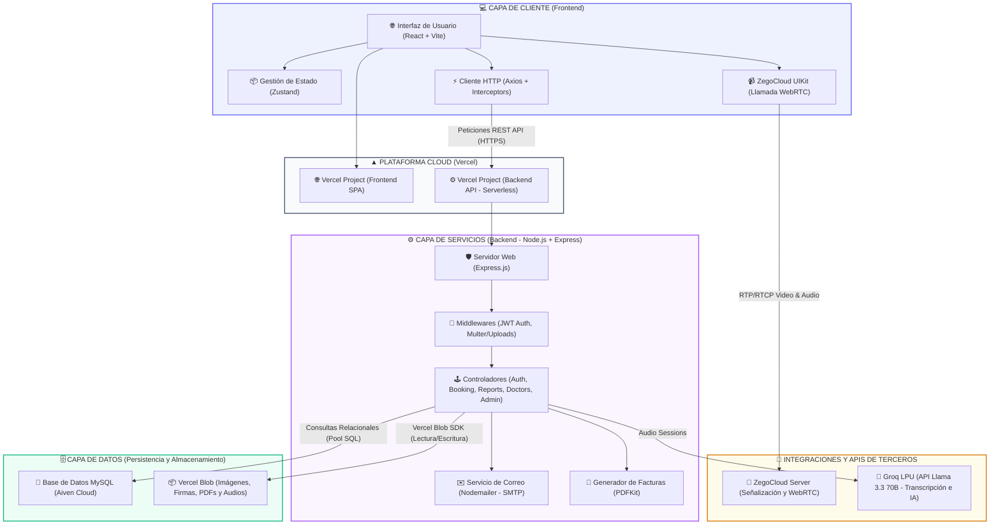

# 🧠 Arquitectura de Software: Mindpath Neuro

Este documento detalla la arquitectura de la plataforma **Mindpath Neuro**, describiendo cómo interactúan sus diferentes capas desde la interfaz de usuario hasta los servicios de inteligencia artificial y la persistencia de datos en la nube.

---

## 📊 Diagrama de Arquitectura de Sistema

El siguiente diagrama representa el flujo de datos y la organización del sistema en capas utilizando la sintaxis de Mermaid:

---

## 🔍 Explicación Detallada de las Capas

La arquitectura de **Mindpath Neuro** está diseñada bajo un modelo de **Arquitectura Cliente-Servidor Desacoplada e Infraestructura 100% Serverless en Vercel**, facilitando que el frontend y el backend escalen de forma independiente y mantengan una alta disponibilidad sin administración de servidores.

### 1. Capa de Cliente (Vite + React)
Es una Single Page Application (SPA) que corre en el navegador del usuario (médicos, pacientes, administradores y supervisores):
*   **React 19 & Vite**: Interfaz de usuario rápida y reactiva estructurada por componentes reutilizables.
*   **Zustand**: Gestor de estado ligero y global para manejar la autenticación del usuario (`useAuthStore`) y las configuraciones de diseño de la marca o tasa de cambio (`useSettingsStore`).
*   **Axios + Interceptors**: Automatiza la inyección del token JWT en la cabecera `Authorization: Bearer <token>` para todas las solicitudes al backend.
*   **ZegoCloud UIKit**: SDK en el cliente que maneja el renderizado de la videollamada a través del estándar WebRTC directamente en la pantalla de teleconsulta.

### 2. Capa de Red y Servidores (Hosting en Vercel)
*   **Vercel Frontend Project**: Aloja los archivos estáticos HTML/JS/CSS de la SPA, distribuyéndolos de forma inmediata mediante la red de CDN global de Vercel.
*   **Vercel Backend Project**: Hospeda el backend Node.js en forma de **Funciones Serverless (Serverless Functions)**. Cuando el cliente hace una solicitud HTTPS, Vercel levanta una instancia efímera de la función de manera inmediata, procesa la lógica a través del enrutador de Express, y la apaga al retornar el JSON.

### 3. Capa de Servicios (Node.js + Express)
Es el núcleo lógico del sistema que procesa las solicitudes del cliente y ejecuta la lógica de negocio en entornos serverless:
*   **Express.js**: Framework encargado de enrutar las solicitudes de la API (`/api/auth`, `/api/bookings`, `/api/reports`, etc.).
*   **Middlewares**: 
    *   `authMiddleware`: Valida la firma del token JWT recibido para dar acceso a rutas restringidas.
    *   `Multer`: Procesa la subida de archivos de pacientes, certificados, firmas de médicos y audios de consulta en transbordo temporal.
*   **Servicios Auxiliares**:
    *   `Nodemailer`: Conexión directa mediante SMTP para notificaciones por correo electrónico (bienvenidas, verificación de correo, restablecimiento de claves y recordatorios de citas).
    *   `PDFKit`: Generación dinámica de facturas en PDF listas para reembolsos médicos, con un sistema de auto-regeneración por si se limpian del almacenamiento temporal.

### 4. Capa de Integración con Terceros
*   **ZegoCloud WebRTC**: Controla los servidores de señalización y canales de comunicación en tiempo real para transmisión de audio/video de baja latencia entre el médico y el paciente.
*   **Groq AI Cloud (API)**: El backend le envía el audio grabado de la consulta y este procesador de lenguaje de altísima velocidad (LPU) utiliza el modelo `llama-3.3-70b-versatile` para transcribir y estructurar la información (motivo de consulta, antecedentes, hallazgos, diagnóstico y tratamiento sugerido).

### 5. Capa de Datos (Persistencia y Vercel Blob)
*   **Base de Datos en Aiven**: Instancia de MySQL en la nube altamente disponible que almacena las tablas relacionales (`users`, `patients`, `doctors`, `appointments`, `consultations`, `clinical_reports`, etc.).
*   **Vercel Blob Storage**: Solución de almacenamiento de objetos integrada en Vercel que aloja de forma permanente las imágenes de perfil, firmas digitales de médicos, audios grabados de sesiones de consulta y los documentos PDF de facturas. El SDK de Vercel Blob maneja la lectura y escritura segura de estos archivos estáticos.
