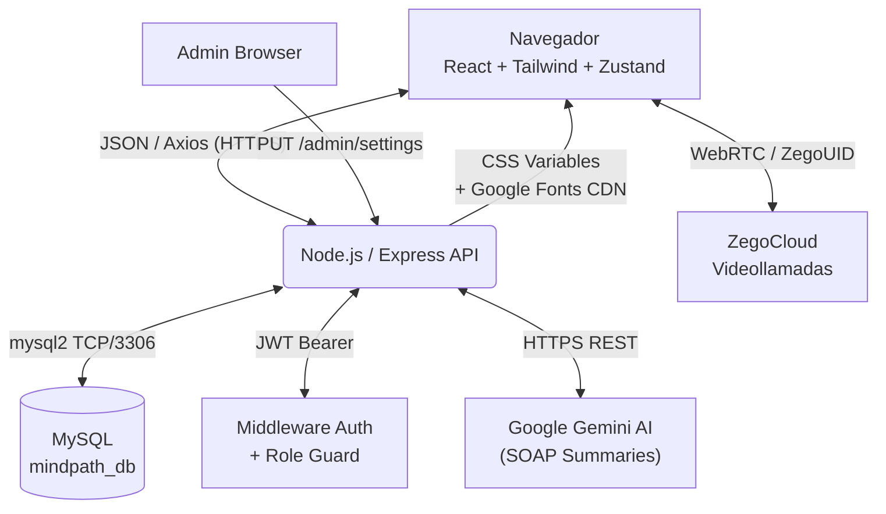
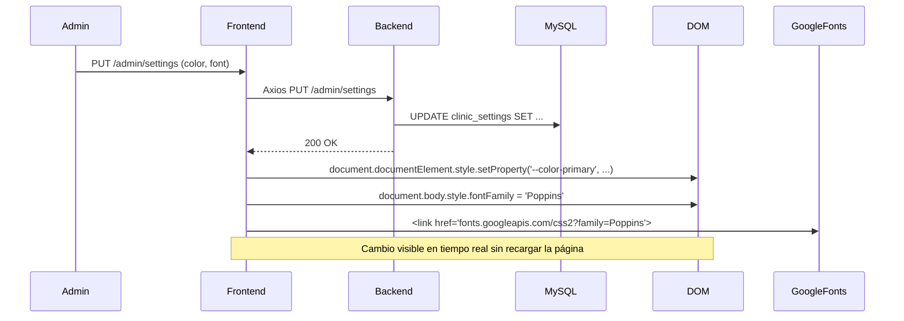
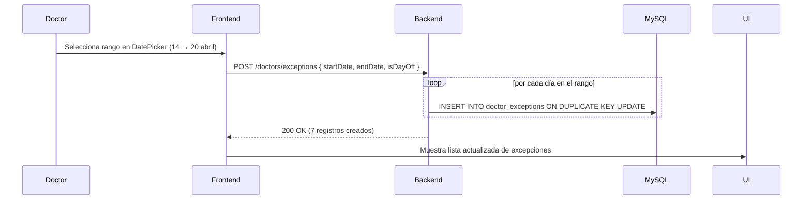

# Arquitectura del Sistema — MindPath Neuro

Este documento detalla el stack tecnológico, el modelo funcional y la filosofía de desarrollo de **Mindpath Neuro**.

---

## 1. Patrón de Arquitectura

El sistema utiliza una arquitectura distribuida **Cliente/Servidor (SPA + API RESTful)**:

1. **Capa de Presentación (Frontend SPA):** React + Vite en modo *Single Page Application*. Maneja UI, rutas de cliente y estado global sin SSR, maximizando la velocidad tras la primera carga.
2. **Capa Lógica (Backend Node.js API):** Express.js orquesta reglas de negocio, procesa IA, valida JWT y actúa como intermediario seguro hacia la base de datos.
3. **Capa Persistente (MySQL):** Base de datos relacional que gestiona las relaciones complejas entre actores (Médicos, Pacientes, Admins) y la trazabilidad histórica completa.

### Diagrama General



---

## 2. Estructura del Código

Se sigue el modelo **MVC Modificado** (Routes → Controllers → Services), garantizando separación de responsabilidades.

```text
mindpath-neuro/
├── backend/
│   ├── config/          # Pool de conexión MySQL
│   ├── controllers/     # Lógica pura por módulo
│   │   ├── authController.js
│   │   ├── bookingController.js
│   │   ├── doctorController.js     # Disponibilidad, excepciones, emergencias
│   │   ├── appointmentController.js
│   │   ├── consultationController.js
│   │   ├── patientController.js
│   │   └── adminController.js      # Stats, usuarios, personalización
│   ├── middlewares/
│   │   ├── authMiddleware.js       # Valida JWT
│   │   └── roleMiddleware.js       # Guard por rol (admin, doctor, patient)
│   ├── routes/          # Mapeo de URI → Controller
│   ├── services/        # Helpers reutilizables (Gemini AI, ZegoCloud tokens)
│   ├── uploads/         # Storage local de avatares y logos
│   ├── setupDB.js       # Instalador automatizado de la BD (Sprint 37)
│   └── server.js        # Punto de entrada Express
├── frontend/
│   └── src/
│       ├── api/
│       │   └── axiosConfig.js      # Instancia Axios + interceptor JWT + auto-logout
│       ├── components/             # UI reutilizable (Cards, Modales, Spinners)
│       ├── pages/
│       │   ├── auth/               # Login, Register
│       │   ├── doctor/
│       │   │   ├── DoctorSchedule.jsx   # Agenda + sub-pestañas + DatePicker
│       │   │   └── DoctorStats.jsx      # Estadísticas con barras proporcionales
│       │   ├── patient/
│       │   │   ├── PatientDashboard.jsx
│       │   │   └── PatientAppointments.jsx
│       │   ├── admin/
│       │   │   └── AdminDashboard.jsx   # Panel admin completo + theming
│       │   └── consultation/
│       │       └── ConsultationRoom.jsx
│       └── store/
│           ├── useAuthStore.js          # Sesión del usuario
│           └── useSettingsStore.js      # Theming dinámico + inyección Google Fonts
└── docs/
    ├── db_mindpath.sql          # Esquema maestro de la BD
    ├── manual_instalacion.md
    ├── technical/               # Arquitectura, API, BD, Seguridad
    ├── manuals/                 # Manuales por rol
    └── ops/                     # Despliegue a producción
```

---

## 3. Decisiones Tecnológicas Clave

### 🎨 Frontend

| Tecnología | Por qué se eligió |
|---|---|
| **Tailwind CSS** | Diseño pixel-perfect, Modo Oscuro nativo, sin overhead de CSS global |
| **Zustand** | Estado global ultra-liviano (reemplaza Redux); ideal para settings y auth |
| **react-datepicker** | Selección de rangos de fechas tipo Airbnb para vacaciones del doctor |
| **CSS Variables dinámicas** | El theming del admin (colores, fuente) se propaga a todo el DOM en tiempo real |
| **Google Fonts CDN (dinámico)** | `<link>` inyectado al `<head>` en tiempo de ejecución sin reiniciar la app |

### ⚙️ Backend

| Tecnología | Por qué se eligió |
|---|---|
| **Express.js** | Modular, minimalista, excelente ecosistema de middlewares |
| **mysql2** | Driver async/await nativo, más rápido que el driver `mysql` original |
| **ZegoCloud** | WebRTC manejado externamente; el servidor Node no carga el tráfico de video |
| **Gemini API** | Genera resúmenes SOAP desde notas rápidas del doctor en lenguaje natural |
| **setupDB.js** | Instalación automatizada de la BD; elimina la dependencia de phpMyAdmin |

---

## 4. Flujo de Theming Dinámico *(Sprint 29 → 37)*



---

## 5. Flujo de Excepciones de Doctor *(Sprint 33/35)*



---

## 6. Filosofía de Evolución

La aplicación está construida de forma modular:
- **Nuevo rol** → Duplicar `/pages/NuevoRol/` + añadir guard en `roleMiddleware.js`
- **Nueva fuente de datos** → Nuevo controlador + ruta en `routes/`
- **Nuevo proveedor de IA** → Nuevo service en `services/` sin tocar controladores
