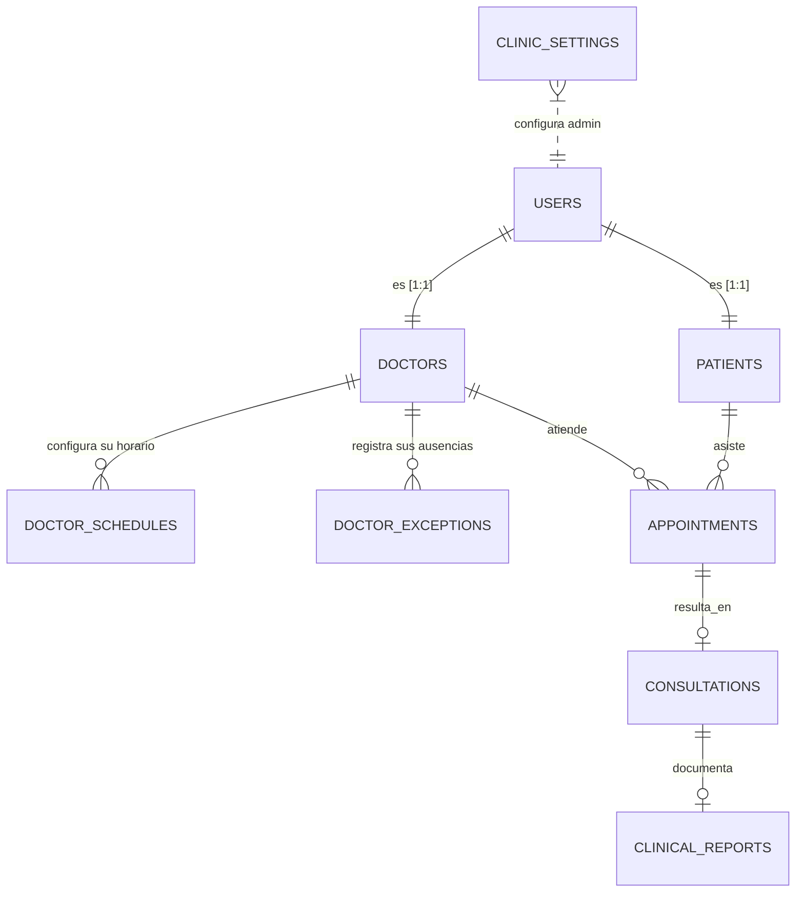

# Esquema de Base de Datos y Modelo de Relaciones (MySQL)

Este documento detalla el diccionario de la base de datos de **Mindpath Neuro**. Todas las tablas siguen una estandarización de nombres en minúscula con `_` (snake_case).

## Diagrama Entidad-Relación

---

## Diccionario de Tablas

### 1. `users` — Núcleo de Autenticación

Tabla base para toda entidad que hace Login. Permite escalabilidad de roles.

| Columna | Tipo | Descripción |
|---|---|---|
| `id` | INT PK | Identificador único |
| `email` | VARCHAR UNIQUE | Correo de acceso |
| `password_hash` | VARCHAR | Contraseña cifrada con Bcrypt |
| `full_name` | VARCHAR | Nombre completo |
| `role` | ENUM | `'patient'`, `'doctor'`, `'admin'`, `'supervisor'` |
| `is_active` | BOOLEAN | Soft-delete / suspensión de cuenta |
| `avatar_url` | VARCHAR | Foto de perfil (Multer) |
| `created_at` | DATETIME | Timestamp de registro |

---

### 2. `doctors` — Datos Profesionales

Relacionada 1:1 con `users` cuando `role = 'doctor'`.

| Columna | Tipo | Descripción |
|---|---|---|
| `user_id` | INT FK | Referencia a `users.id` |
| `specialty` | VARCHAR | Especialidad médica |
| `license_number` | VARCHAR | Cédula / Colegiado |
| `is_verified` | BOOLEAN | Aprobado por administración |
| `consultation_fee` | DECIMAL | Tarifa de consulta |
| `experience_years` | INT | Años de ejercicio |
| `rating` | DECIMAL(3,2) | Promedio de calificaciones |
| `is_emergency_blocked` | BOOLEAN | Bloqueo de agenda por emergencia médica |
| `emergency_block_until` | DATETIME | Fecha de expiración del bloqueo |

---

### 3. `patients` — Ficha del Paciente

Relacionada 1:1 con `users` cuando `role = 'patient'`.

| Columna | Tipo | Descripción |
|---|---|---|
| `user_id` | INT FK | Referencia a `users.id` |
| `date_of_birth` | DATE | Fecha de nacimiento |
| `gender` | ENUM | `'M'`, `'F'`, `'O'` |
| `phone` | VARCHAR | Teléfono de contacto |
| `emergency_contact_phone` | VARCHAR | Contacto de emergencia |

---

### 4. `doctor_schedules` — Disponibilidad Semanal Regular

Define la rutina semanal del doctor (horario fijo por día de la semana).

| Columna | Tipo | Descripción |
|---|---|---|
| `id` | INT PK | — |
| `doctor_id` | INT FK | Referencia a `doctors.user_id` |
| `day_of_week` | ENUM | `Monday` a `Sunday` |
| `start_time` | TIME | Inicio del turno |
| `end_time` | TIME | Fin del turno |
| `slot_duration` | INT | Duración de cada cita (minutos) |

---

### 5. `doctor_exceptions` — Excepciones y Vacaciones *(Sprint 33/35)*

Permite al doctor marcar días donde su horario regular **no aplica**, ya sea por vacaciones, día libre o un turno especial diferente al habitual.

| Columna | Tipo | Descripción |
|---|---|---|
| `id` | INT PK | — |
| `doctor_id` | INT FK | Referencia a `doctors.user_id` |
| `exception_date` | DATE UNIQUE | El día en cuestión |
| `is_day_off` | BOOLEAN | `1` = día libre completo, `0` = turno especial |
| `start_time` | TIME NULL | Hora inicio (si no es día libre) |
| `end_time` | TIME NULL | Hora fin (si no es día libre) |

> **Nota:** El backend acepta rangos (`startDate` → `endDate`) y crea múltiples filas automáticamente mediantes un bucle `while`. El frontend usa `react-datepicker` en modo `selectsRange` para la entrada visual de rangos.

---

### 6. `appointments` — Agendamiento de Citas

El encuentro cruzado entre Paciente y Doctor.

| Columna | Tipo | Descripción |
|---|---|---|
| `id` | INT PK | — |
| `doctor_id` | INT FK | — |
| `patient_id` | INT FK | — |
| `appointment_date` | DATE | Fecha de la cita |
| `start_time` | TIME | Hora de inicio |
| `status` | ENUM | `'pending'`, `'confirmed'`, `'completed'`, `'cancelled'`, `'emergency_reschedule'` |
| `type` | ENUM | `'virtual'`, `'presential'` |
| `cancellation_reason` | TEXT | Motivo de cancelación |

---

### 7. `consultations` & `clinical_reports` — Expediente Médico

**`consultations`** — Sala de videollamada:

| Columna | Tipo | Descripción |
|---|---|---|
| `id` | INT PK | — |
| `appointment_id` | INT FK UNIQUE | 1:1 con `appointments` |
| `status` | ENUM | `'scheduled'`, `'in-progress'`, `'completed'` |
| `start_time` | DATETIME | Momento de ingreso a sala |
| `end_time` | DATETIME | Momento de cierre |

**`clinical_reports`** — Informe SOAP:

| Columna | Tipo | Descripción |
|---|---|---|
| `consultation_id` | INT FK | — |
| `antecedentes` | TEXT | Antecedentes del paciente |
| `hallazgos` | TEXT | Hallazgos clínicos |
| `diagnostico` | TEXT | Diagnóstico |
| `tratamiento` | TEXT | Plan de tratamiento |
| `private_notes` | TEXT | Notas privadas del doctor (no visibles al paciente) |
| `is_shared` | BOOLEAN | Si el paciente puede ver/descargar el PDF |

---

### 8. `clinic_settings` — Configuración del Sistema *(Sprint 29+)*

Persiste la personalización estética y de marca de la clínica, aplicada dinámicamente en todo el frontend vía `useSettingsStore`.

| Columna | Tipo | Descripción |
|---|---|---|
| `id` | INT PK | — |
| `clinic_name` | VARCHAR | Nombre de la clínica (Sidebar, emails) |
| `logo_url` | VARCHAR | Path o URL del logo |
| `primary_color` | VARCHAR | Color primario HEX (ej. `#6D28D9`) |
| `primary_hover` | VARCHAR | Color hover de botones |
| `font_family` | VARCHAR | Fuente del sistema (Google Fonts o preset) |

---

## Notas Transaccionales

- Motor **InnoDB** en todas las tablas. FK con `ON DELETE CASCADE` donde aplica.
- Las fechas se guardan agnósticas al timezone del servidor (`DATETIME`). El frontend convierte a hora local usando el helper `toLocalISO()` para evitar *offset shift* por UTC.
- El estado `emergency_reschedule` en `appointments` es el valor persistido cuando el sistema cancela en masa por un bloqueo de emergencia del doctor.
