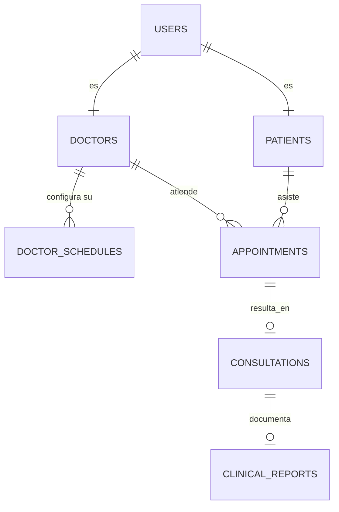

# Esquema de Base de Datos y Modelo de Relaciones (MySQL)

Este documento detalla el diccionario de la base datos de **Mindpath Neuro**. Todas las tablas siguen una estandarización de nombres en minúscula con `_` (snake_case).

## Diagrama Entidad-Relación Inicial

## Diccionario de Tablas Principales

### 1. `users` (El núcleo de autenticación)

Tabla base para toda entidad que hace Log In. Permite escalabilidad.

- `id`: INT (PK)
- `email`: VARCHAR (UNIQUE)
- `password_hash`: VARCHAR (Bcrypt)
- `role`: ENUM (`'patient'`, `'doctor'`, `'admin'`, `'supervisor'`)
- `is_active`: BOOLEAN (Soft delete o Ban de sistema)
- Maneja los avatares y fechas en general.

### 2. `doctors` (Datos Profesionales)

Relacionada 1 a 1 con la tabla `users` mediante `user_id`. Existe únicamente si el user.role es `'doctor'`.

- `user_id`: INT (FK)
- `specialty`: VARCHAR
- `license_number`: VARCHAR
- `is_verified`: BOOLEAN (Aprobado por los administradores de la clínica).
- `consultation_fee`: DECIMAL (Tarifa).
- `experience_years`, `languages`, `education`, etc.

### 3. `patients` (Ficha Básica del Paciente)

Similar a `doctors`, relacionada 1 a 1 con `users` si role es `'patient'`.

- `user_id`: INT (FK)
- `date_of_birth`: DATE
- `gender`: ENUM (`'M'`, `'F'`, `'O'`)
- `phone`: VARCHAR
- `emergency_contact_phone`: VARCHAR

### 4. `doctor_schedules` (Disponibilidad Dinámica)

Donde el Doctor define sus turnos.

- `doctor_id`: INT (FK)
- `day_of_week`: ENUM (Monday - Sunday)
- `start_time`: TIME
- `end_time`: TIME
- `slot_duration`: INT (Minutos. Soporta 30, 60, etc.)

### 5. `appointments` (El Agendamiento)

El encuentro cruzado entre Paciente y Doctor a través del Booking y Calendario.

- `id`: INT (PK)
- `doctor_id`: INT (FK)
- `patient_id`: INT (FK)
- `appointment_date`: DATE
- `start_time`: TIME
- `status`: ENUM (`'pending'`, `'confirmed'`, `'completed'`, `'cancelled'`)
- `type`: ENUM (`'virtual'`, `'presential'`)

### 6. `consultations` & `clinical_reports` (Expediente Médico)

La sala de urgencias y la hoja clínica de diagnóstico.
**consultations**:

- `id`: INT (PK)
- `appointment_id`: INT (FK, UNIQUE)
- `status`: ENUM ('scheduled', 'in-progress', 'completed')
- `start_time`: DATETIME (Registro del "Click" de entrar a sala).

**clinical_reports**: (Derivado de _consultations_, donde se aplica la matriz SOAP + Notas del doctor).

- `consultation_id`: INT (FK)
- `antecedentes`: TEXT
- `hallazgos`: TEXT
- `diagnostico`: TEXT
- `tratamiento`: TEXT
- `private_notes`: TEXT (Anotaciones exclusivas no visibles por el paciente)
- `is_shared`: BOOLEAN (Visible en el PDF Dashboard del paciente).

## Notas Transaccionales

- Las tablas en el sistema son InnoDB. Las relaciones FK ejecutan `ON DELETE CASCADE` para ciertos campos (ej. al borrar a un User, MySQL borrará su entrada respectiva en Doctors o Patients y su historial inactivo).
- Las fechas se guardan siempre de forma agnóstica a la zona horaria del servidor `DATETIME`, pero usando husos compatibles locales bajo ISO para evitar desplazamientos por GMT en el frontend de citas (Sprint 28).
